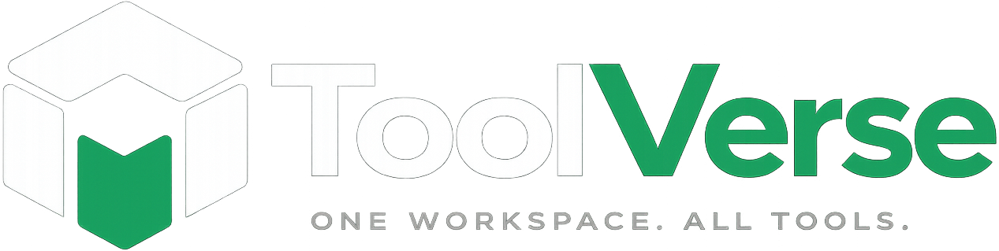

  
  <h1>Changelog All notable changes to this project will be documented in this file.</h1>

## [Version 1.0.0]

### 🚀 Initial Public Release

#### 📦 Features Added

- **35 Browser-Based Tools** organized into 6 categories:
  - 📄 **PDF Tools** (3): Compress, merge, and convert PDFs
  - 🖼️ **Image Tools** (3): Compress, resize, and remove backgrounds
  - 💻 **Developer Tools** (19): JSON utilities, formatters, validators, generators, converters
  - 💰 **Finance Tools** (5): GST, EMI, SIP, tax calculators, and invoice generator
  - 📄 **Resume Tools** (0): Coming soon
  - 📱 **Social Tools** (5): QR code generator, meta tag generator, OG preview, tweet generator, and hashtag generator

#### 🔒 Privacy & Security

- **Privacy-First Architecture** - 100% client-side processing, no data leaves user's device
- **No Server Storage** - Elimination of data breach risks through client-only processing
- **Optional API Keys** - External service keys stored locally, never transmitted unless used
- **Input Sanitization** - Protection against XSS and injection attacks where applicable

#### ⚡ Productivity & UX

- **Built-In Productivity Widget** - Floating tasks & notes interface with keyboard shortcut (Cmd/Ctrl+K)
- **PWA Support** - Installable app with offline capabilities
- **Light/Dark Mode** - Automatic system preference detection with manual toggle
- **Accessibility Features** - Semantic HTML, ARIA labels, keyboard navigation, skip links
- **SEO Optimization** - JSON-LD metadata, dynamic sitemap, canonical URLs

#### 🛠️ Development & Infrastructure

- **Comprehensive Documentation** - Detailed README with usage examples and contributing guidelines
- **Development Setup** - Pre-configured with TypeScript, ESLint, Prettier, Vitest
- **Environment Configuration** - Secure handling of optional API keys (remove.bg, iLovePDF)
- **MIT License** - Permissive open source license
- **GitHub Repository** - Complete source code with issue templates and contributing guidelines

---

  <em>Looking for the latest release? Check out the <a href="https://github.com/srinathnulidonda/toolverse/releases">GitHub Releases</a> page.</em>

