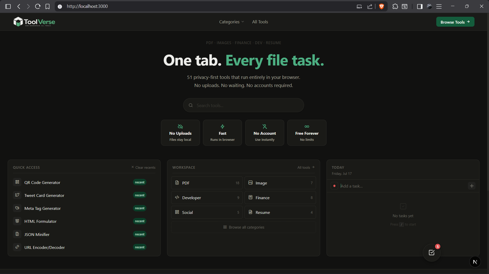
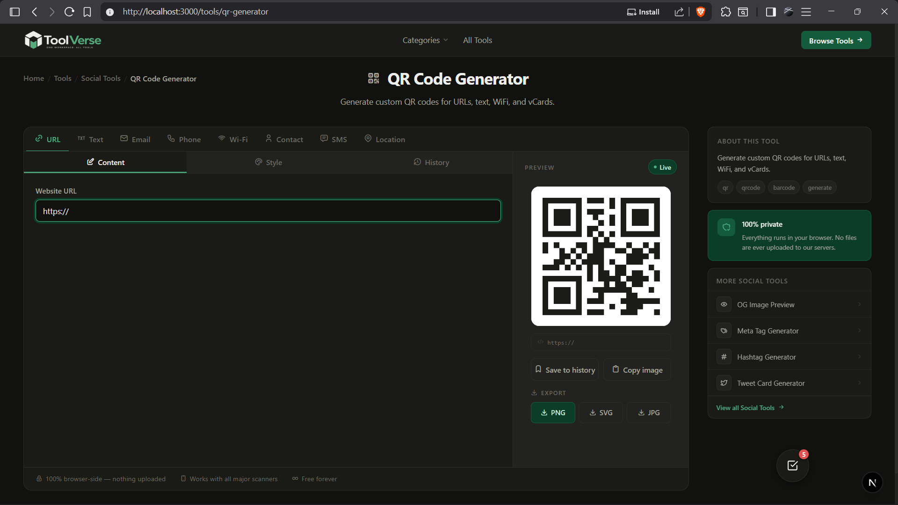
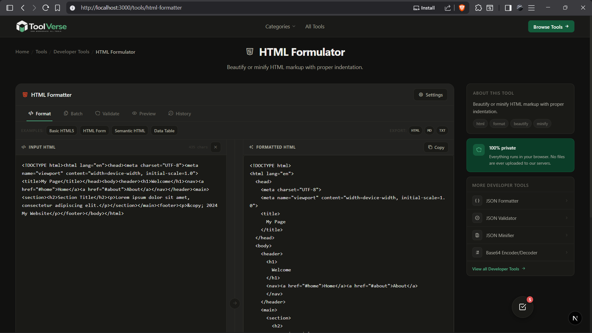
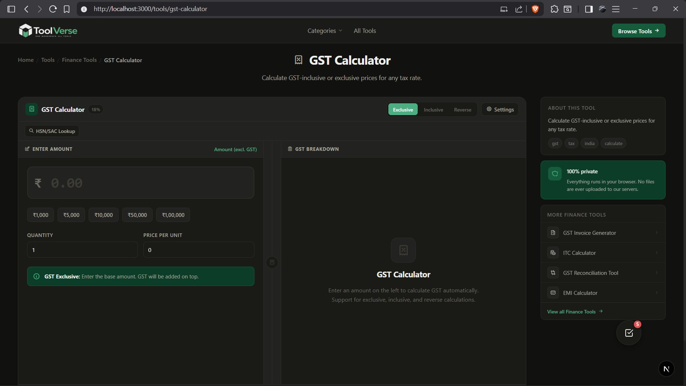

<div align="center">


### Free utility hub offering 50+ client‑side tools for PDF, image, development, finance, resume, and social tasks – **all processing stays in your browser**

[](https://toolverse.vercel.app)
[](https://github.com/srinathnulidonda/toolverse#readme)
[](https://github.com/srinathnulidonda/toolverse/issues)
[](https://github.com/srinathnulidonda/toolverse/issues)
[](https://discord.gg/yourserver)

</div>

## ✨ Features

- **50+ Client-Side Tools** - PDF, image, developer, finance, resume, and social tools - all processing stays in the browser (zero uploads)
- **Next.js 16 with Turbopack** - Blazing fast builds and updates
- **TypeScript Strict Mode** - Enterprise-grade type safety
- **Centralized History Store** - `useHistoryStore` hook for seamless state management
- **Production-Ready Logger** - Automatically strips console calls in production
- **Error Boundaries** - Graceful UI fallback for unexpected errors
- **Full Test Suite** - Vitest (jsdom) with 80% coverage threshold
- **Professional Code Quality** - Linted with ESLint, formatted with Prettier
- **Responsive Design** - Works flawlessly on mobile, tablet, and desktop
- **Accessibility Focused** - WCAG 2.1 compliant components
- **PWA Ready** - Installable web app with offline capabilities

## 🛠️ Tool Categories

| Category | Tools | Description |
|----------|-------|-------------|
| 📄 **PDF** | 9 tools | Compress, merge, split, convert, rotate PDFs |
| 🖼️ **Image** | 8 tools | Compress, resize, convert, crop, remove background |
| ⚙️ **Developer** | 24 tools | JSON utils, formatters, validators, generators, converters |
| 💰 **Finance** | 10 tools | GST, EMI, SIP, tax calculators, currency converter |
| 📄 **Resume** | 5 tools | Builder, checker, cover letter, LinkedIn summary |
| 🔗 **Social** | 4 tools | QR codes, meta tags, hashtag generator, tweet cards |

## 🚀 Quick Start

### Prerequisites

- Node.js ≥ 18
- pnpm (recommended) or npm/yarn

### Installation

```bash
# Clone the repository
git clone <repository-url>
cd toolverse

# Install dependencies
pnpm install          # or npm install / yarn

# Start development server
pnpm dev              # http://localhost:3000
```

### Production Build

```bash
# Build for production
pnpm build

# Run the built app
pnpm start
```

## 📖 Usage Examples

### Using Developer Tools

```bash
# Format JSON
pnpm dev
# Navigate to /tools/json-formatter

# Generate secure passwords  
# Visit /tools/password-generator

# Convert timestamps
# Go to /tools/timestamp-converter
```

### Using Finance Tools

```bash
# Calculate GST
# Visit /tools/gst-calculator

# Generate invoices
# Go to /tools/gst-invoice-generator

# Calculate EMI
# Navigate to /tools/emi-calculator
```

## 📸 Screenshots

<div align="center">
  
  <p><em>Toolverse Home Page</em></p>
</div>


<div align="center">
  
  
  <p><em>QR Code Generator (left) and HTML Formatter (right) tools in action</em></p>
</div>

<div align="center">
  
  <p><em>GST Calculator tool in action</em></p>
</div>

## 📁 Project Structure

```
toolverse/
├── app/                    # Next.js App Router
│   ├── layout.tsx          # Root layout with providers
│   ├── page.tsx            # Homepage
│   ├── tools/              # Tools directory
│   │   ├── page.tsx        # Tools index
│   │   └── [slug]/         # Individual tool pages
│   │       ├── page.tsx    # Tool description/marketing
│   │       └── client-page.tsx # Actual tool implementation
│   ├── (legal)/            # Legal pages (cookies, privacy, terms)
│   └── (marketing)/        # Marketing pages (about, contact, faq)
├── components/             # Reusable UI components
│   ├── layout/             # Layout components (navbar, footer)
│   ├── home/               # Homepage sections
│   ├── tools-directory/    # Tools browsing components
│   ├── category-tools/     # Category-specific tool components
│   ├── tool/               # Individual tool components
│   ├── shared/             # Shared utilities (history, workspace)
│   ├── search/             # Search functionality
│   ├── categories/         # Category browsing
│   └── ui/                 # Primitive UI components
├── data/                   # Centralized data layer
│   ├── tools.ts            # Tool definitions (50+ tools)
│   ├── categories.ts       # Category metadata
│   └── collections.ts      # Tool collections
├── lib/                    # Utility functions & hooks
│   ├── tools.ts            # Tool-related helpers
│   ├── historyStore.ts     # Centralized history management
│   └── logger.ts           # Production-ready logger
├── public/                 # Static assets
│   ├── favicon.png         # Browser favicon
│   ├── logo.png            # Application logo
│   └── manifest.json       # PWA manifest
└── styles/                 # Global CSS styles
```

## 🔧 Available Scripts

| Script | Description |
|--------|-------------|
| `pnpm dev` | Start Next.js development server (`next dev`) |
| `pnpm build` | Production build (`next build`) |
| `pnpm start` | Run the built application (`next start`) |
| `pnpm lint` | Run ESLint for code quality checks |
| `pnpm format` | Format code with Prettier |
| `pnpm test` | Run Vitest test suite |
| `pnpm test:watch` | Run tests in watch mode |
| `pnpm type-check` | Run TypeScript type checking |

## 🌐 Environment Variables

| Variable | Required? | Description |
|----------|-----------|-------------|
| `NEXT_PUBLIC_SENTRY_DSN` | No | Sentry DSN for error tracking (set in `.env.local`) |
| `NEXT_PUBLIC_APP_URL` | **Yes** | Base URL for metadata generation (e.g., `https://toolverse.vercel.app`) |

## 🤝 Contributing

We welcome contributions! Please follow these steps:

1. **Fork** the repository
2. **Create** your feature branch (`git checkout -b feature/amazing-feature`)
3. **Make** your changes
4. **Ensure** lint passes: `pnpm lint && pnpm format`
5. **Verify** tests pass: `pnpm test`
6. **Commit** your changes (`git commit -m 'Add amazing feature'`)
7. **Push** to the branch (`git push origin feature/amazing-feature`)
8. **Open** a Pull Request

### Development Guidelines

- Follow existing code style (ESLint + Prettier)
- Write tests for new functionality
- Keep components small and focused
- Use TypeScript strictly - avoid `any` types
- Add JSDoc comments for complex functions
- Ensure accessibility compliance (WCAG 2.1)
- Optimize for performance - minimize re-renders

### Reporting Issues

Please use the [GitHub Issues](https://github.com/srinathnulidonda/toolverse/issues) to report bugs or request features. Include:

- Clear description of the issue
- Steps to reproduce
- Expected vs actual behavior
- Screenshots (if applicable)
- Environment details (browser, OS, etc.)

## 📄 License

This project is private / UNLICENSED.

## 📞 Contact & Support

- **Questions?** Open an issue or reach out at srinathnulidonda@gmail.com
- **Documentation:** Visit individual tool pages for usage instructions
- **Updates:** Follow for new tool releases and feature improvements

## 🙏 Acknowledgments

- Built with [Next.js](https://nextjs.org/)
- Icons powered by [Templarian](https://templarian.com/)
- Inspired by the open-source developer tools community
- Special thanks to all contributors and users

<div align="center">
  <sub>Built with ❤️ by <a href="https://github.com/srinathnulidonda">Srinath Nulidonda</a></sub>
</div>